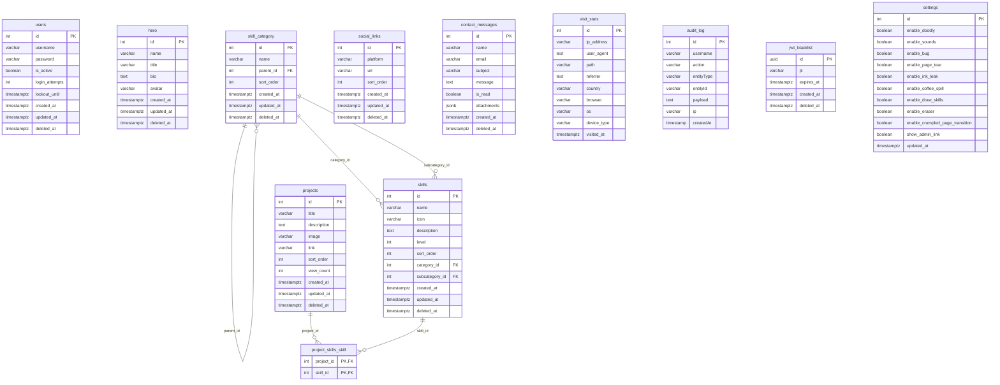

# Схема базы данных (Database Schema)

В проекте используется база данных **PostgreSQL**. Доступ к БД осуществляется через ORM **TypeORM** в NestJS.

Ниже представлена структура таблиц и диаграмма сущностей.

---

## Диаграмма сущностей (Entity-Relationship Diagram)

Поскольку это персональное портфолио, таблицы в основном не имеют жестких связей (внешних ключей), за исключением логической привязки данных.

---

## Подробное описание таблиц (Tables Description)

### 1. `users` — Пользователи (Администраторы)
Таблица хранит учетные данные администраторов для входа в панель управления.
- `id` (int, PK): Уникальный инкрементный идентификатор.
- `username` (varchar(50)): Логин (уникальный).
- `password` (varchar(255)): Хэш пароля (bcrypt).
- `is_active` (boolean): Статус активности учетной записи.
- `login_attempts` (int): Счетчик неудачных попыток входа (для защиты от брутфорса).
- `lockout_until` (timestamptz): Время, до которого аккаунт временно заблокирован при превышении попыток.
- `created_at` (timestamptz): Дата создания.
- `updated_at` (timestamptz): Дата обновления.
- `deleted_at` (timestamptz, nullable): Мягкое удаление.

### 2. `hero` — Блок приветствия (Hero Section)
Данные для главного экрана портфолио.
- `id` (int, PK)
- `name` (varchar(100)): Имя или никнейм разработчика.
- `title` (varchar(150)): Заголовок / специализация.
- `bio` (text): Описание / приветственный текст.
- `avatar` (varchar(255)): Ссылка на изображение аватара.
- `created_at` / `updated_at` / `deleted_at` (timestamptz)

### 3. `skill_category` — Категории навыков (Skill Categories)
Иерархическая структура категорий и подкатегорий для группировки навыков.
- `id` (int, PK): Уникальный идентификатор.
- `name` (varchar(100)): Название категории/подкатегории.
- `parent_id` (int, FK, nullable): Ссылка на родительскую категорию (для подкатегорий).
- `sort_order` (int): Порядок сортировки.
- `created_at` / `updated_at` / `deleted_at` (timestamptz)

### 4. `skills` — Навыки (Skills)
Перечень навыков, привязанных к категориям.
- `id` (int, PK)
- `name` (varchar(100)): Название навыка (например, React, NestJS).
- `icon` (varchar(255)): Класс иконки или эмодзи.
- `description` (text): Краткое пояснение.
- `level` (int): Уровень владения (0-100%).
- `sort_order` (int): Порядок сортировки.
- `category_id` (int, FK, nullable): Ссылка на корневую категорию навыка.
- `subcategory_id` (int, FK, nullable): Ссылка на подкатегорию навыка.
- `created_at` / `updated_at` / `deleted_at` (timestamptz)

### 5. `projects` — Проекты (Portfolio Projects)
Список выполненных работ.
- `id` (int, PK)
- `title` (varchar(255)): Название проекта.
- `description` (text): Детальное описание.
- `image` (varchar(500)): Путь к скриншоту/превью.
- `link` (varchar(500)): Ссылка на проект/GitHub.
- `sort_order` (int): Порядок ручной сортировки.
- `view_count` (int): Счетчик просмотров проекта пользователями.
- `created_at` / `updated_at` / `deleted_at` (timestamptz)

### 6. `project_skills_skill` — Связь проектов и навыков (Project Skills Link)
Таблица связи (Many-to-Many) для привязки навыков к конкретным проектам.
- `project_id` (int, PK, FK): Ссылка на проект (`projects.id`).
- `skill_id` (int, PK, FK): Ссылка на навык (`skills.id`).

### 7. `social_links` — Социальные сети (Social Links)
Ссылки на профили в социальных сетях.
- `id` (int, PK)
- `platform` (varchar(100)): Название (например, GitHub, LinkedIn).
- `url` (varchar(255)): Ссылка.
- `sort_order` (int): Порядок сортировки.
- `created_at` / `updated_at` / `deleted_at` (timestamptz)

### 8. `contact_messages` — Обратная связь (Contact Form Messages)
Сообщения, отправленные через контактную форму.
- `id` (int, PK)
- `name` (varchar(100)): Имя отправителя.
- `email` (varchar(150)): Email отправителя.
- `subject` (varchar(255)): Тема сообщения.
- `message` (text): Текст сообщения.
- `is_read` (boolean): Прочитано ли администратором.
- `attachments` (jsonb): Массив путей к загруженным файлам.
- `created_at` / `deleted_at` (timestamptz)

### 9. `visit_stats` — Статистика посещений (Visit Stats)
Лог посещений сайта реальными пользователями.
- `id` (int, PK)
- `ip_address` (varchar(45)): Анонимизированный или полный IP.
- `user_agent` (text): Строка User-Agent.
- `path` (varchar(1000)): Посещенный путь (например, `/`).
- `referrer` (text): Откуда пришел пользователь.
- `country` (varchar(10)): Код страны по GeoIP.
- `browser` (varchar(50)): Название браузера.
- `os` (varchar(50)): Операционная система.
- `device_type` (varchar(20)): Тип устройства (desktop/mobile/tablet).
- `visited_at` (timestamptz): Время посещения.

### 10. `audit_log` — Логи действий администратора (Admin Audit Logs)
История изменений, выполненных авторизованными пользователями в админке.
- `id` (int, PK)
- `username` (varchar(255)): Логин админа.
- `action` (varchar(100)): Тип действия (например, `CREATE_PROJECT`).
- `entityType` (varchar(100)): Сущность (например, `Project`).
- `entityId` (varchar(50)): ID сущности.
- `payload` (text): Сериализованные изменения (JSON).
- `ip` (varchar(50)): IP-адрес админа.
- `createdAt` (timestamp): Время изменения.

### 11. `jwt_blacklist` — Черный список токенов (JWT Blacklist)
Используется для мгновенного разлогина и инвалидации выданных токенов.
- `id` (uuid, PK)
- `jti` (varchar(255)): Идентификатор JWT токена.
- `expires_at` (timestamptz): Время истечения жизни токена.
- `created_at` / `deleted_at` (timestamptz)

### 12. `settings` — Настройки сайта (Portfolio Settings)
Управление интерактивными элементами, пасхалками и звуками.
- `id` (int, PK, default=1): Всегда одна запись.
- `enable_doodly` (boolean): Помощник Doodly.
- `enable_sounds` (boolean): Звуковые эффекты.
- `enable_bug` (boolean): Ползающий жук.
- `enable_page_tear` (boolean): Игра крестики-нолики.
- `enable_ink_leak` (boolean): Эффект пролитых чернил.
- `enable_coffee_spill` (boolean): Интерактивная чашка кофе.
- `enable_draw_skills` (boolean): Рисование иконок.
- `enable_eraser` (boolean): Инструмент ластика.
- `enable_crumpled_page_transition` (boolean): Эффект сминаемой страницы.
- `show_admin_link` (boolean): Ссылка на админку в шапке.
- `updated_at` (timestamptz): Последнее изменение настроек.
